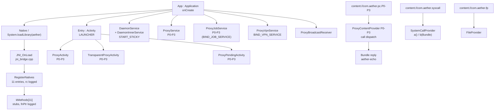

# Phase 1 architecture (visible layer)

Scope: the **visible layer** mirrored by `aether-engine/` — the component families, the JNI bridge, and the provider dispatch path.

Excluded by decision: the C2 / seller layer, external endpoints, and the hidden payload. No network call exists anywhere in this tree (static proof: `phase-a1/evidence/none_ok.txt`).

## Component map

| family | classes (real nested classes) | manifest registration |
|---|---|---|
| Activities | `Entry`, `ProxyActivity` + P0–P3, `TransparentProxyActivity` + P0–P3, `ProxyPendingActivity` + P0–P3 | 14 activities, only `Entry` exported |
| Services | `DaemonService` + `DaemonInnerService`, `ProxyService` + P0–P3, `ProxyJobService` + P0–P3, `ProxyVpnService` | 11 services, none exported |
| Providers | `ProxyContentProvider` + P0–P3, `SystemCallProvider`, `FileProvider` | 6 providers, authorities `com.aether.pc.P0-P3`, `com.aether.syscall`, `com.aether.fp` |
| Receiver | `ProxyBroadcastReceiver` | 1 receiver, not exported |
| Native | `Native.kt` (11 `external fun`), `jni_bridge.cpp`, `runtime_init.cpp` (Phase 2 slot, intentionally empty) | `libaether.so`, arm64-v8a |

## Dispatch path

`App.onCreate` → `Native()` (companion `init` → `System.loadLibrary("aether")`) → `JNI_OnLoad` → `FindClass("com/aether/helper/Native")` → `RegisterNatives(kMethods, 11)` → fnPtr log lines → `Entry` lifecycle. Provider calls are answered locally by `ProxyContentProvider.call` with an `aether-echo` bundle.