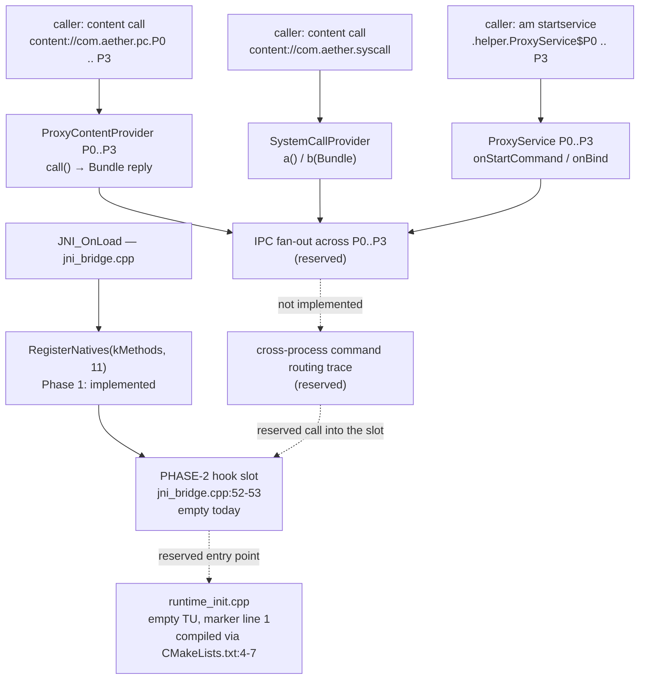

# Phase 2 architecture (design only — NOT executed)

> **Phase 2 has NOT been executed.** This document describes the reserved shape of Phase 2 work.
> No Phase 2 code exists, no endpoint is called, and no runtime behaviour changes today. Everything
> below is either *present as an empty marker* (named with its real file/line) or *reserved* (does not
> exist in the tree).

Scope source: `docs/phase2-plan.md`. Marker inventory: `docs/phase2-hooks.md`. Draft acceptance:
`docs/phase2-acceptance.md`.

## 1. Runtime patch slot (marker present, empty)

- **Current state:** a comment-only slot inside `JNI_OnLoad` after `RegisterNatives(clazz, kMethods, 11)`,
  at `aether-engine/app/src/main/cpp/jni_bridge.cpp` **lines 52–53**
  (`// PHASE-2 hook slot (ยังไม่ implement)` and the commented-out `// runtime_patch_apply(env, clazz);`).
  `aether-engine/app/src/main/cpp/runtime_init.cpp` is an intentionally empty translation unit whose
  **line 1** carries the matching marker; it is compiled into `libaether.so` by
  `CMakeLists.txt` lines 4–7 (`add_library(aether SHARED jni_bridge.cpp runtime_init.cpp)`).
- **Phase 2 would add:** a real entry point wired to that slot, with its implementation living in
  `runtime_init.cpp` (the reserved TU) rather than in the registration path, so the registration
  behaviour proven in Phase 1 stays byte-for-byte unchanged.
- **Explicitly out of scope:** no memory-permission change, no code-page write path, no external
  target, no payload. Any such work needs its own order (see § Forbidden).

## 2. IPC fan-out (components present, fan-out reserved)

- **Current state:** four real nested provider classes — `ProxyContentProvider.P0` … `P3`
  (`ProxyContentProvider.kt` lines 26–29) registered on authorities `com.aether.pc.P0` … `com.aether.pc.P3`
  (`AndroidManifest.xml` lines 55–58), plus `SystemCallProvider` on `com.aether.syscall` (line 60) with
  `a()` / `b(Bundle)` at `SystemCallProvider.kt` lines 26 / 30. Each instance answers `call()`
  independently with a local `aether-echo` bundle (`ProxyContentProvider.kt` line 11).
- **Phase 2 would add:** a fan-out that dispatches one command across the four proxy instances P0..P3
  and the system-call provider, and records per-instance dispatch (which instance answered, in what
  order, with which reply). Today no instance knows about the others: there is no registry and no
  cross-instance call.
- **Explicitly out of scope:** no new provider, no new authority, no exported component. The fan-out
  target set is the four existing instances plus the existing system-call provider.

## 3. Cross-process command routing (reserved)

- **Current state:** the application is **single-process** — no component in
  `aether-engine/app/src/main/AndroidManifest.xml` declares `android:process` (verified: zero matches),
  and every target in § 2 is declared `android:exported="false"`, so a non-root `adb shell` caller may
  be refused (recorded as an operator note in `docs/phase-a2-plan.md` § A2.4).
- **Phase 2 would add:** the trace of a command's route from caller → resolved component → provider
  instance → result bundle, including the process/UID each hop runs under, so the routing is provable
  rather than assumed. Phase A2 supplies the single-process baseline this trace is measured against.
- **Explicitly out of scope:** no multi-process deployment change, no `android:process` split, no
  exported surface, no permission or identity change.

## Forbidden — mirrored from the Phase A rules

Not in this document, and not in Phase 2 **as scoped here**:

- any C2 / external endpoint, and any networking call of any kind;
- any seller-layer component;
- any hidden payload or imported binary;
- any of the §15 token names enforced by the CI guard
  (`.github/workflows/aether-engine.yml`, step "Phase 1 contract tests … forbidden tokens", guard at
  line 227) — the guard's pattern lists them, so this document refers to the pattern instead of
  reproducing it;
- any change to the locks: AGP 8.5.0 / Kotlin 1.9.24, SDK 35/28/35, arm64-v8a only, no signing config.

## Status

Design only. Phase 2 stays closed until Phase A2 closes; execution requires a separate order from the
Commander (`docs/phase2-plan.md` § Preconditions).
